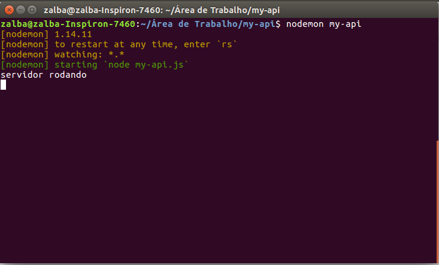

# Nodemon

## Melhorando o funcionamento do nosso servidor

Você já deve ter percebido que sempre que fizermos uma alteração na nossa aplicação teremos que reiniciar o servidor para subir as atualizações.

Ok, subir um servidor com sucesso no primeiro momento parece muito legal, mas depois de horas de programação ter que obrigatoriamente subir o servidor a cada alteração pode ser tudo o que você não vai querer fazer enquanto estiver trabalhando. Mas sem desespero, pois para solucionar esse problema podemos utilizar o [Nodemon.](https://nodemon.io/)

Ele permite que a gente rode um script em Node.js que fica monitorando os arquivos. Caso você faça uma alteração, o Nodemon reinicia automaticamente o servidor. Para instalá-lo, vamos utilizar o "gerenciador" de dependências NPM \(NPM é o um gerenciador de pacotes que usamos em nossas aplicações para baixar módulos ou ferramentas na nossa API\).

```
$ npm install -g nodemon
```

Pronto! Agora você pode alterar seus arquivos que o Nodemon vai reiniciar nosso servidor automaticamente.

Para usarmos o Nodemon para subir o servidor, basta digitar no terminal o comando:

```text
$ nodemon my-api
```



